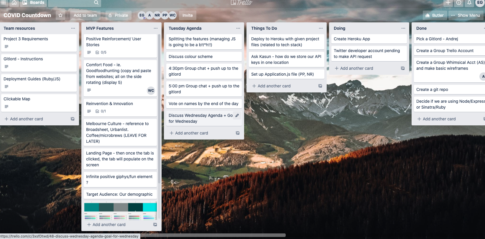
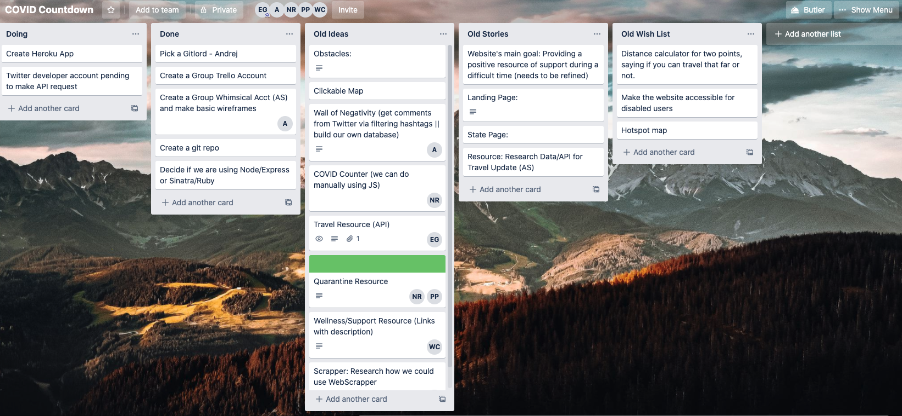
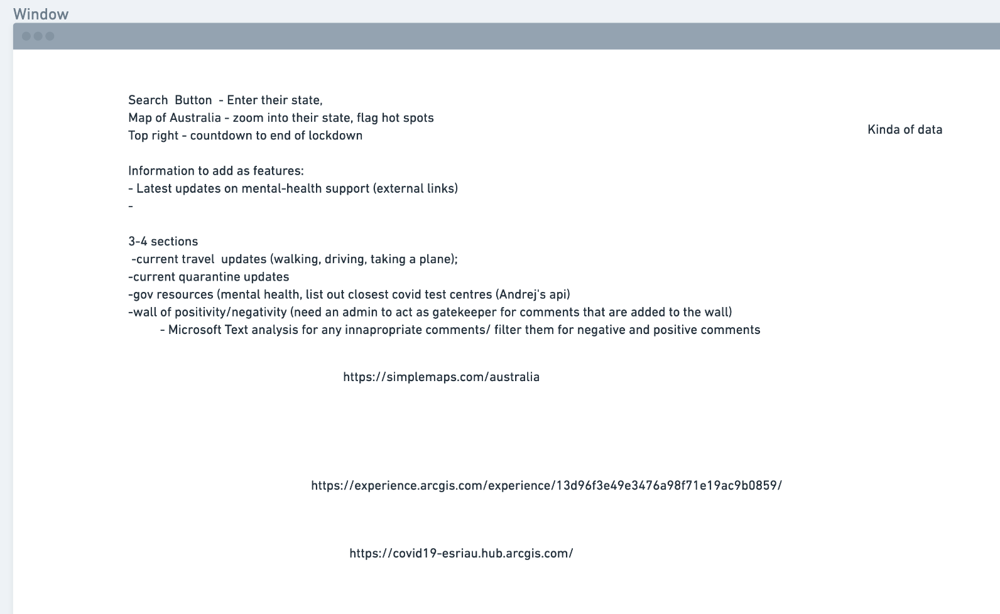
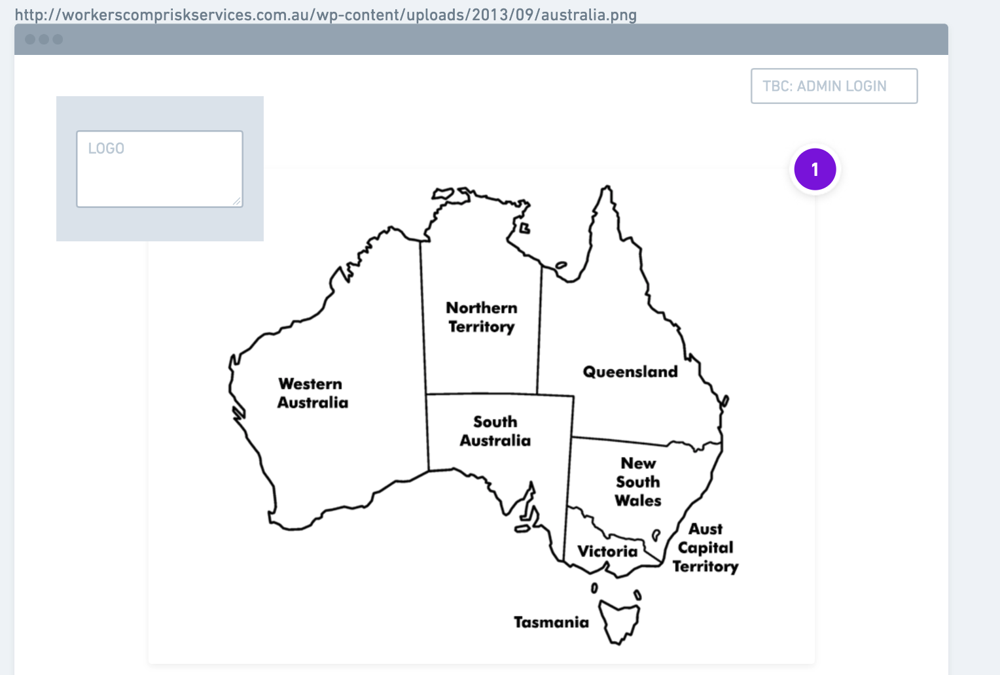
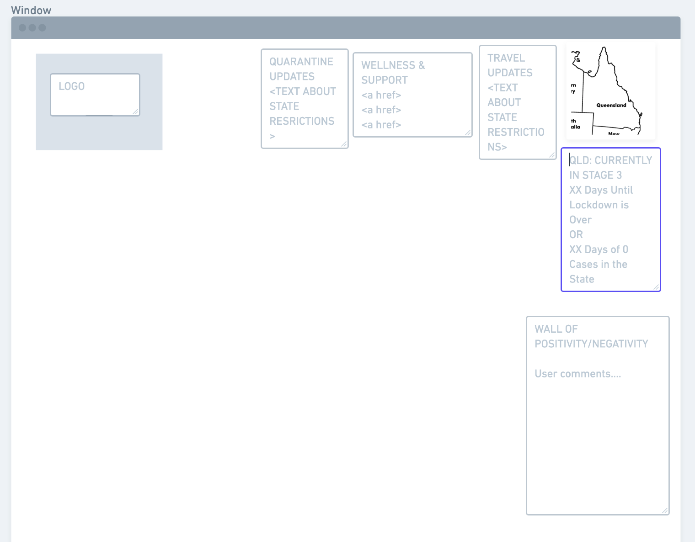

# COVID App - Group assignment 

The idea of this application or website is to provide the Australians with some positive support throughout the COVID crisis. 

## Application Features 

The application utilises two different API services, one if Microsofts Text Analysis service wich analyses our posts for positivity sentiment, we only allow 50% and above positive sentiment to be displayed on the page. For the other API service we tapped into is a Tasty food API which provides users with random comfort food recipies to make during lockdown.

The tech stack is as follows: 
- Ruby on Rails (Active Record)
- Sinatra 
- JavaScript 
- HTML/CSS 

## Planning process 

Initially the plan was to have a webpage that will track positive news, case decline and a countdown timer until end of lockdown, alongside this it would be a resource for government and services assistance for health and wellness throughout the lockdown/ pandemic. 

Throughout the planning process the idea changed from having a statistics page about cases  with resources for each state to having stories about the positive side of things that they have experienced throughout the COVID process. Along with this we included recipies that should be easy to make with ingredients that people have in their house. 

