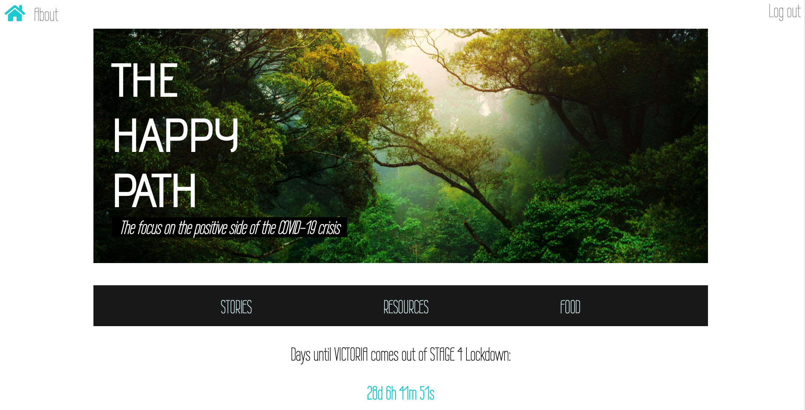
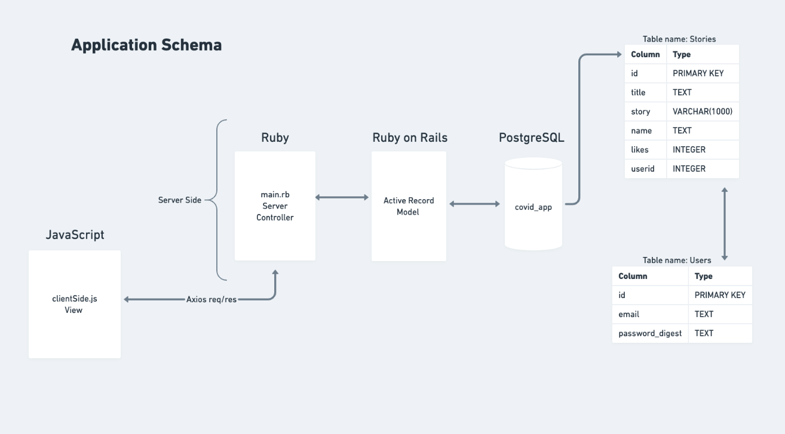

# The Happy Path - COVID Support App

[Check the app out here](https://floating-cliffs-04957.herokuapp.com/)

The idea of this application or website is to provide Australians with some positive support throughout the COVID crisis. This was a group assignment that required our class of five to collaborate on a project and learn from the challenges and achievements of working with each other. The overall design brief was to build a full-stack web application using technologies of our choice. 

## Application Features 

The application utilises two different API services, one is Microsofts Text Analysis service wich analyses user posts for positivity sentiment. The other API service we tapped into is a Tasty food API which provides users with random comfort food recipies to make during lockdown.

We have also compiled a list of support services that individuals affected by the COVID crisis can utilise as they wish. 

The tech stack is as follows: 
- Ruby on Rails (Active Record)
- PostrgeSQL
- Sinatra 
- JavaScript 
- HTML/CSS 
- 2x API services 

## Planning process 

Initially the plan was to have a webpage that will track positive news, case decline and a countdown timer until end of each state's lockdown, alongside this it would be a resource for government and services assistance for health and wellness throughout the lockdown/ pandemic. 

Throughout the planning process the idea changed from having a statistics page about cases with resources for each state to having stories about the positive side of things that people have experienced throughout the lockdown period. Along with this we included recipies that people might enjoy while they are in lockdown. 

#### Key challenges 

Some of the important features that we wanted to include were the ability for users to share their stories via a Tweet, though we found that there was a waiting period to get a developer account approved with twitter to do an integration with Oauth. The original plan pivoted to a more traditional method of storing the data into a local database that would later be deployed to Heroku. 

#### Screenshots of planning process

